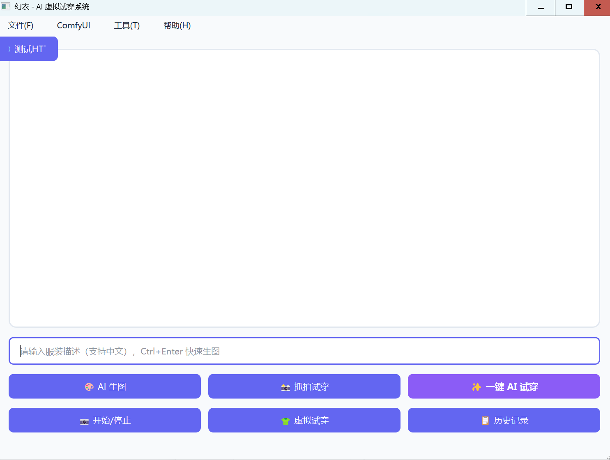
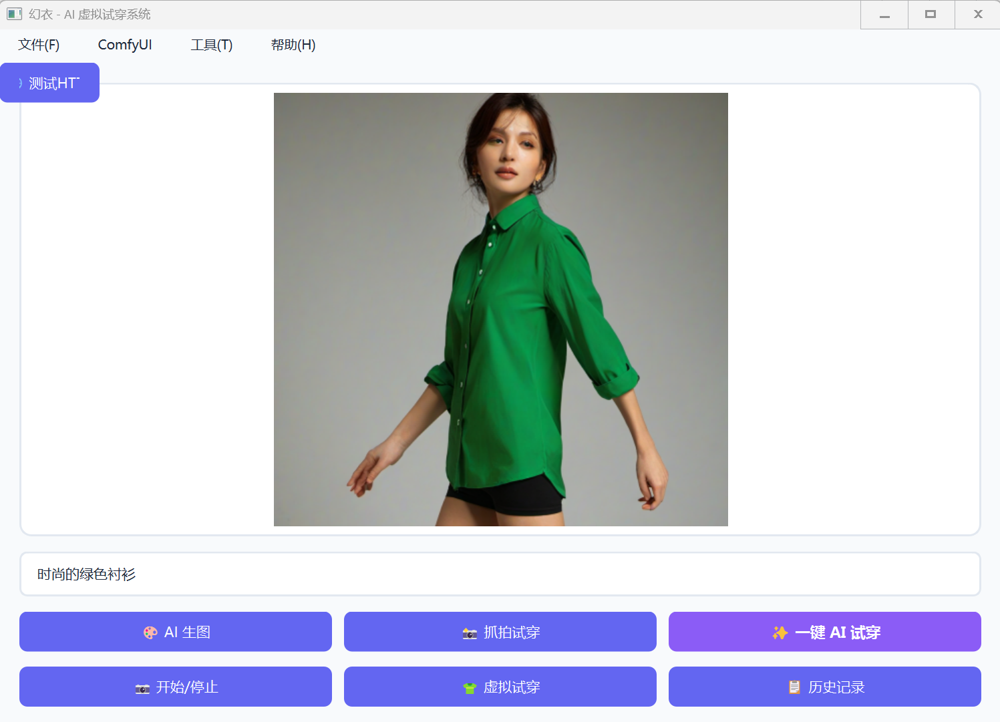
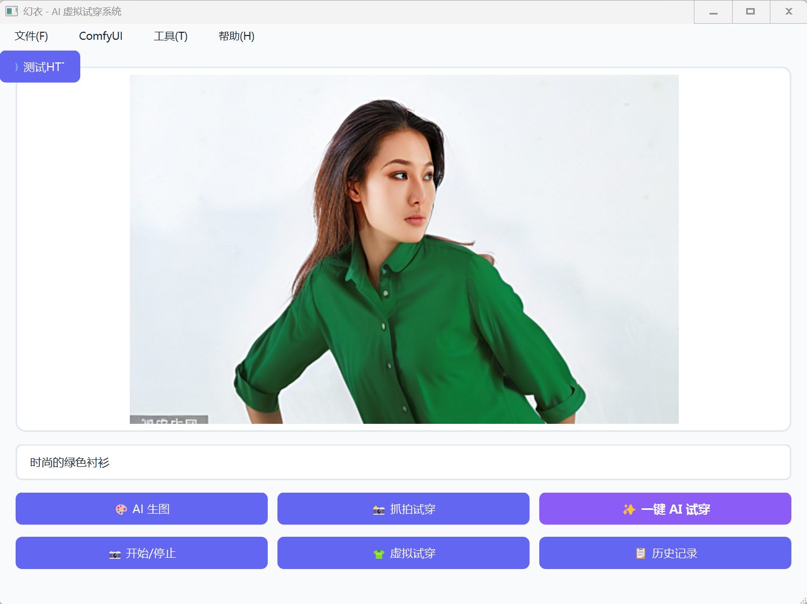
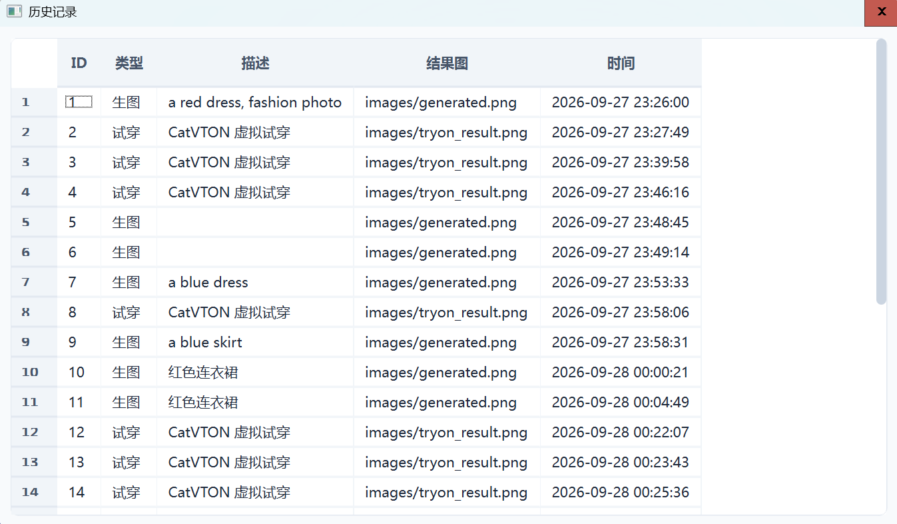

# 幻衣 - AI 虚拟试穿系统

> 一个基于 **Qt + OpenCV + ComfyUI + CatVTON** 的桌面端 AI 虚拟试穿系统。

输入中文服装描述，AI 自动生成服装图，并试穿到人物身上。

---

## ✨ 功能特性

| 功能 | 说明 |
|------|------|
| 🎨 **AI 生图** | 输入中文描述（如"红色连衣裙"），自动翻译并调用 Stable Diffusion 生成服装图 |
| 👕 **虚拟试穿** | 基于 CatVTON，把服装图穿到人物身上 |
| 📸 **抓拍试穿** | 摄像头抓拍，自动检测人脸、生成遮罩、试穿 |
| ✨ **一键 AI 试穿** | 输入描述 → 生图 → 试穿，一键完成 |
| 📋 **历史记录** | SQLite 存储所有生图/试穿记录 |
| 🌐 **中文翻译** | 输入中文自动翻译成英文，无需手动翻译 |
| 🚀 **自动启动 ComfyUI** | 点击按钮自动检测并启动 ComfyUI 服务 |

---

## 📸 效果截图

### 主界面


### AI 生图


### 虚拟试穿


### 历史记录


---

## 🛠 技术栈

| 模块 | 工具 | 用途 |
|------|------|------|
| **界面** | Qt 6.8.3 | 桌面应用框架 |
| **图像处理** | OpenCV 4.11 | 人脸检测、遮罩生成、图像后处理 |
| **HTTP** | Qt Network | 调用 ComfyUI API |
| **数据库** | SQLite | 存储历史记录 |
| **AI 生图** | Stable Diffusion（ComfyUI） | 生成服装图 |
| **AI 试穿** | CatVTON | 虚拟试穿 |
| **翻译** | MyMemory API | 中文 → 英文 |

---

## 📦 环境要求

| 项目 | 版本 |
|------|------|
| **操作系统** | Windows 10 / 11 |
| **Qt** | 6.8.3（MinGW 13.1.0 64-bit）|
| **OpenCV** | 4.11.0（MinGW 编译版）|
| **CMake** | 3.16+ |
| **ComfyUI** | 秋叶整合包（含 CatVTON 节点）|
| **显卡** | NVIDIA RTX 4060（8GB 显存）+ |

---

## 开始

### 1. 克隆项目

```bash
git clone https://github.com/xianyu-0/huanyi.git
cd huanyi
2. 配置依赖
OpenCV：下载 OpenCV MinGW 版，解压到指定目录，修改 CMakeLists.txt 里的路径。

ComfyUI：安装 秋叶整合包，并安装：

comfyui-try-on 节点（CatVTON）

模型下载到 ComfyUI/models/catvton/

3. 编译运行
用 Qt Creator 打开 CMakeLists.txt，选择 Desktop Qt 6.8.3 MinGW 64-bit 套件，点击运行。

📁 项目结构
text
huanyi/
├── CMakeLists.txt              # CMake 配置
├── main.cpp                    # 入口
├── mainwindow.h                # 主窗口声明
├── mainwindow.cpp              # 主窗口实现
├── mainwindow.ui               # UI 设计文件
├── style.qss                   # QSS 样式表
├── workflow_api.json           # AI 生图 API（ComfyUI）
├── tryon_workflow_api.json     # 虚拟试穿 API（CatVTON）
├── images/                     # 图片资源
│   ├── body.jpg                # 默认人物图
│   ├── shirt.png               # 默认服装图
│   └── ...
├── haarcascade_frontalface_default.xml   # 人脸检测模型
└── README.md
🔧 核心代码说明
AI 生图
cpp
// 1. 中文自动翻译成英文
translateToEnglish(prompt);

// 2. 调用 ComfyUI 生图
startGenerate(translatedPrompt);

// 3. 下载生成的图片
downloadImage(filename, subfolder, isTryOn=false);
虚拟试穿
cpp
// 1. 准备人物图、服装图、遮罩
forceCopy(bodyPath, comfyInput + "body.jpg");
forceCopy(shirtPath, comfyInput + "shirt.png");
forceCopy(maskPath, comfyInput + "body_mask.png");

// 2. 调用 CatVTON API
manager->post(tryonRequest, json);

// 3. 下载试穿结果
downloadImage(filename, subfolder, isTryOn=true);
自动启动 ComfyUI
cpp
// 检查端口 8188 是否响应
if (!isComfyRunning()) {
    // 启动 ComfyUI 进程
    comfyProcess->start("python.exe", args);
    // 轮询等待启动完成
}
📌 开发环境
Qt Creator 14.0+

编译器 MinGW 13.1.0（Qt 自带）

构建系统 CMake

IDE Qt Creator / VS Code

🐛 已知问题
首次启动慢：ComfyUI 加载模型需要 2~3 分钟

中文翻译依赖网络：需要访问 api.mymemory.translated.net

显存要求：CatVTON 试穿需要 6GB+ 显存

📄 License
本项目仅供学习交流使用。

🙏 致谢
ComfyUI

CatVTON

OpenCV

Qt

text

---

## 📄 第 2 步：创建 `.gitignore`

在项目目录下**新建 `.gitignore`**，内容如下：

```gitignore
# 构建目录
build/
build-*/
*.user
*.user.*

# Qt 自动生成
.qmake.stash
Makefile
moc_*.cpp
moc_*.h
ui_*.h
qrc_*.cpp
*.autosave

# OpenCV 库（体积大，不上传）
OpenCV_MingW-main/

# 数据库
*.db
*.sqlite

# 临时文件
*.o
*.obj
*.tmp
*.log

# IDE
.vscode/
.idea/
*.swp

# 生成的图片（保留必要的模板）
# images/generated.png
# images/tryon_result.png

# Windows
Thumbs.db
Desktop.ini

# 大量下载的模型（不上传）
# 说明：模型文件请在 README 里说明下载方式